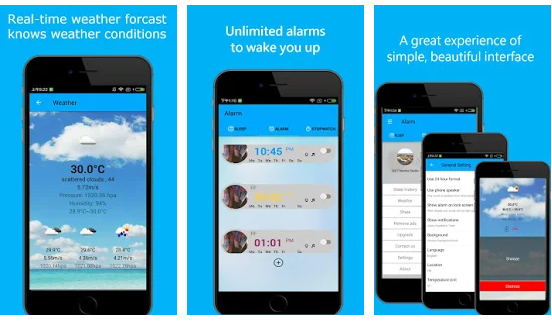

# Android Alarm Clock
 Android Alarm Clock is an alarm clock and weather forecast for Android smartphones that brings pure alarm experience to you by powerful features and clean interface. There is demo to study how to make great alarm clock. The App has been published on Google Play on 2017.
 

 
 
# Features
* Low volume gentle alarm which starts some time before the main alarm (when you are in good sleep phase to wake up, you will hear the low volume alarm and wake up most refreshed. 30 minutes is most of the time enough to catch the fast sleep phase)
* Cool time picker like in Jelly Bean. No more spinning, only phone-style keyboard!
* Volume fade in and vibration starting only after completed fade in
* 7-days weather forecast which can check today weather when wakeup
* Sleeping period will be recorded on phone, it can suggest you which time period can be better

## Support
- Minimum SDK API 18
- Maximum SDK API 25
- Gradle v2.3.0